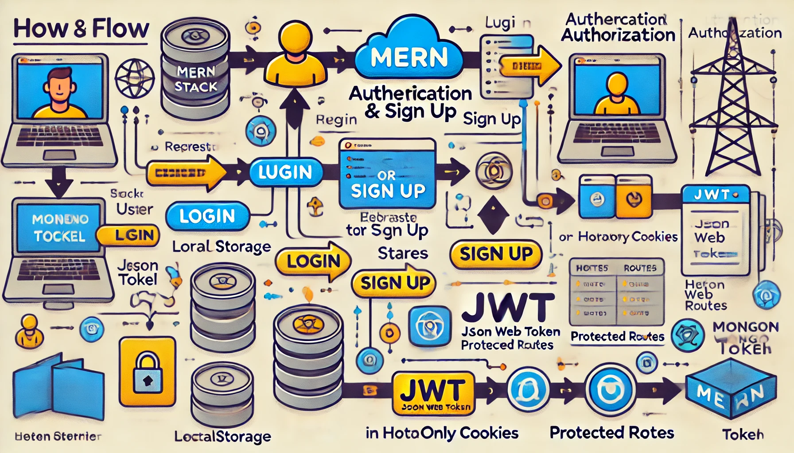
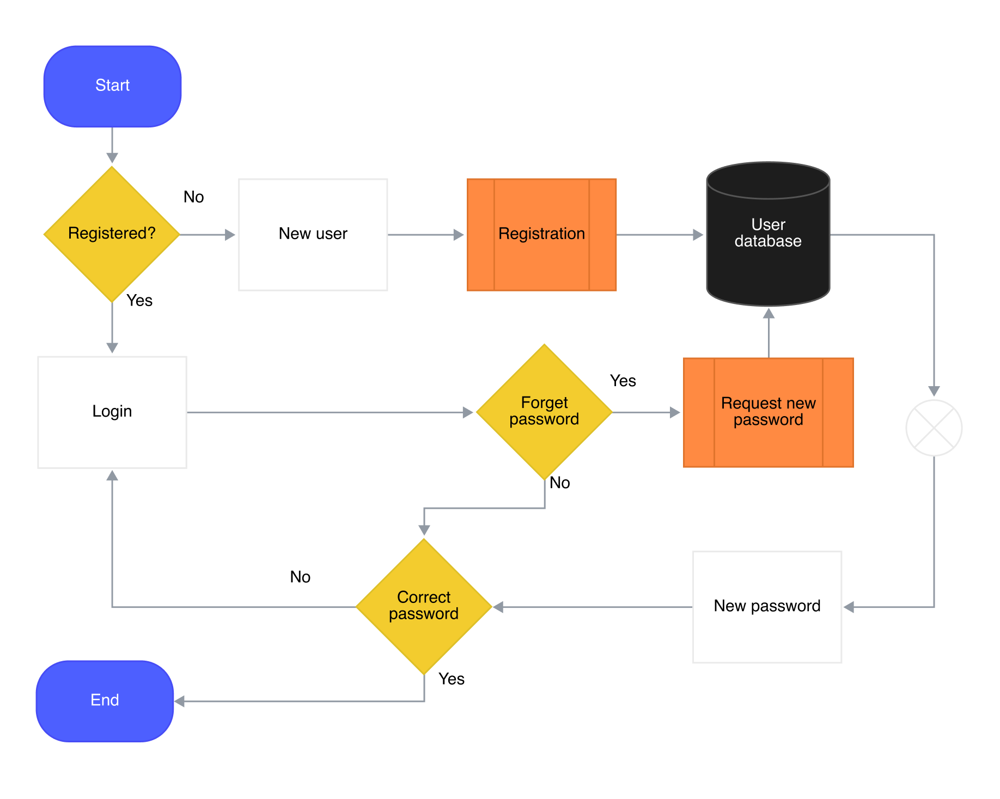

# Authentication and Authorization in MERN Stack

Authentication ensures that users are who they say they are, while authorization determines what those users are allowed to do. This README will cover the conceptual flow of a MERN-based authentication system along with key insights.

---

## Table of Contents

1. [Introduction](#1-introduction)
2. [MERN Stack Overview](#2-mern-stack-overview)
3. [Authentication vs Authorization](#3-authentication-vs-authorization)
4. [Code Flow and System Structure](#4-code-flow-and-system-structure)
5. [Core Components](#5-core-components)
6. [Login and Sign-Up Flow Diagram](#6-login-and-sign-up-flow-diagram)
7. [Role-Based Access Control](#7-role-based-access-control)
8. [Protected Routes Overview](#8-protected-routes-overview)
9. [Conclusion](#9-conclusion)

---

## 1. Introduction

This guide explores how authentication (login/signup) and authorization (role-based access control) are implemented using the **MERN stack**—**MongoDB, Express, React, and Node.js**. It also highlights token-based authentication through **JSON Web Tokens (JWT)** and discusses the concept of protected routes.

---

## 2. MERN Stack Overview

| **Layer**      | **Technology** | **Role**                                |
| -------------- | -------------- | --------------------------------------- |
| Frontend       | React          | User Interface, Handles Login Forms     |
| Backend        | Express.js     | Manages API Routes and Logic            |
| Database       | MongoDB        | Stores User Data and Roles              |
| Authentication | JWT            | Token-based Authentication for Sessions |

---

## 3. Authentication vs Authorization

| **Aspect** | **Authentication**         | **Authorization**                          |
| ---------- | -------------------------- | ------------------------------------------ |
| Definition | Verifying user identity    | Determining user permissions               |
| When?      | During login/sign-up       | After authentication is complete           |
| Purpose    | Ensures user is legitimate | Grants access based on user role           |
| Example    | Login using email/password | Admins can access dashboards, users cannot |

---

## 4. Code Flow and System Structure

1. **User Registration (Sign-Up):**

   - User provides email, password, and name.
   - Password is hashed using bcrypt.
   - User data is stored in MongoDB.

2. **User Login:**

   - User submits email and password.
   - Backend verifies the password and generates a JWT token.
   - JWT is stored in the frontend (local storage or cookies).

3. **JWT Verification and Protected Routes:**

   - Backend verifies JWT on each request.
   - If valid, the user can access protected routes.
   - If the user is an admin, they can access admin routes.

4. **Logout Process:**
   - JWT is removed from storage or cookies.
   - User session ends, blocking access to protected resources.

---

## 5. Core Components

| **Component**            | **Description**                                |
| ------------------------ | ---------------------------------------------- |
| JWT Token                | Stores user identity and session information   |
| bcrypt                   | Hashes passwords for security                  |
| Protected Routes         | Routes accessible only to authenticated users  |
| Role-based Authorization | Determines access based on roles (e.g., admin) |

---

## 6. Login and Sign-Up Flow Diagram

**Explanation:**

- **User Registration:** Inputs are validated and stored in the database.
- **User Login:** Credentials are verified, and a token is generated.
- **JWT:** The token acts as a key for accessing protected routes.

---

## 7. Role-Based Access Control

| **Role** | **Permissions**                     |
| -------- | ----------------------------------- |
| User     | Can access personal dashboard       |
| Admin    | Can manage other users and settings |
| Guest    | Limited access to public resources  |

**Example:**

- A user can only view their profile.
- An admin can view and modify all user profiles.

---

## 8. Protected Routes Overview

### What are Protected Routes?

Protected routes ensure that only authenticated users can access certain parts of the application. The token (JWT) is verified by the backend before granting access.

### Diagram of Route Protection:

---

## 9. Conclusion

Implementing authentication and authorization is crucial for ensuring security in web applications. The MERN stack simplifies the process with tools like **JWT**, **bcrypt**, and **role-based access control**. This guide outlined the basic structure, flow, and best practices for setting up authentication and authorization in the MERN stack.

---
